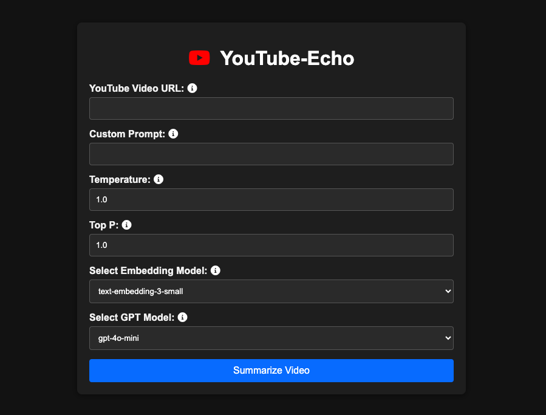

---

# YouTube Echo

YouTube Echo is a powerful and user-friendly FastAPI application that provides quick and accurate summaries of YouTube videos. This innovative tool leverages OpenAI's language models to analyze video transcripts and generate concise summaries based on user-defined prompts. Designed for efficiency, YouTube Echo aims to save users time and enhance their content consumption experience.



## Table of Contents

- [Key Features](#key-features)
- [Installation](#installation)
  - [Prerequisites](#prerequisites)
  - [Setup](#setup)
- [Usage](#usage)
  - [API Endpoint](#api-endpoint)
  - [Request Example](#request-example)
  - [Response Structure](#response-structure)
- [Streamlit Interface](#streamlit-interface)
  - [Running the Streamlit App](#running-the-streamlit-app)
- [Benefits of Using YouTube Echo](#benefits-of-using-youtube-echo)
- [Running Tests](#running-tests)
- [Contributing](#contributing)
- [License](#license)
- [Acknowledgments](#acknowledgments)

## Key Features

- **Instant Summarization**: Quickly generate summaries of YouTube videos without the need to watch them in full. Perfect for busy individuals who want to grasp key points quickly.
  
- **Customizable Summaries**: Users can provide custom prompts to tailor the summary to their specific needs, allowing for a more personalized content extraction.

- **Efficient API Key Management**: The application includes built-in validation for OpenAI API keys to ensure secure and efficient access.

- **Robust Error Handling**: The API gracefully handles errors, providing meaningful feedback for invalid requests, such as incorrect URLs or missing parameters.

- **Streamlit Interface**: A user-friendly web interface to interact with the summarization functionality, allowing for easy input of video URLs and display of results.

## Installation

### Prerequisites

Before you begin, ensure you have the following installed:

- Python 3.7 or later
- pip (Python package installer)

### Setup

Follow these steps to set up the YouTube Echo application on your local machine:

1. **Clone the Repository**:
   Open your terminal and run the following command to clone the repository:
   ```bash
   git clone https://github.com/itsmohitkumar/YouTube-Echo.git
   cd YouTube-Echo
   ```

2. **Create a Virtual Environment**:
   It's recommended to create a virtual environment to manage dependencies. Run:
   ```bash
   python -m venv env
   source env/bin/activate  # On Windows, use `env\Scripts\activate`
   ```

3. **Install Dependencies**:
   Use pip to install the required libraries:
   ```bash
   pip install -r requirements.txt
   ```

4. **Configure Environment Variables**:
   Create a `.env` file in the root directory of your project. Add your OpenAI API key to this file:
   ```
   OPENAI_API_KEY=your_api_key
   ```

## Usage

To start the FastAPI application, use the command below. This will launch a development server:
```bash
uvicorn src.fastapi:app --reload
```
Once the server is running, you can access the API at `http://127.0.0.1:8000`.

### API Endpoint

#### Summarize Video

- **Method**: POST
- **URL**: `/summarize`

### Request Example

To summarize a YouTube video, send a POST request with the following JSON body:
```json
{
    "video_url": "https://www.youtube.com/watch?v=example",
    "custom_prompt": "Summarize this video.",
    "temperature": 0.7,
    "top_p": 0.9,
    "model": "gpt-3.5-turbo"
}
```

### Response Structure

- **Successful Response (200 OK)**:
  ```json
  {
      "summary": "This is a concise summary of the video."
  }
  ```

- **Error Responses**:
  - **400 Bad Request**: Invalid URL or missing fields.
    ```json
    {
        "detail": "Invalid URL"
    }
    ```
  - **422 Unprocessable Entity**: Incorrect input fields.
    ```json
    {
        "detail": "Field 'video_url' is required."
    }
    ```

## Streamlit Interface

The Streamlit interface provides a convenient way to interact with the YouTube Echo application.

### Running the Streamlit App

To run the Streamlit application, use the following command:
```bash
streamlit run streamlit.py
```
Once the server is running, you can access the Streamlit app at `http://localhost:8501`.

### Features of the Streamlit App

- **User-Friendly Input**: Enter YouTube video URLs and optional custom prompts.
- **Live Summarization**: Click a button to generate summaries, with real-time feedback.
- **Model Configuration**: Adjust settings like temperature and top_p for customized summarization.

## Benefits of Using YouTube Echo

In today's fast-paced world, consuming content efficiently is crucial. YouTube Echo empowers users by:

- **Reducing Time Spent**: Watch hours of video content in a fraction of the time by reading concise summaries.
  
- **Enhancing Learning**: Quickly grasp key concepts and ideas from educational content without the distractions of lengthy videos.

- **Improving Productivity**: Ideal for professionals who need to stay updated on industry trends without dedicating hours to watching videos.

- **Supporting Diverse Needs**: Whether you're a student, a busy professional, or a casual viewer, YouTube Echo provides a tailored solution for efficient content consumption.

## Running Tests

To ensure everything is functioning correctly, you can run the unit tests included in the repository:
```bash
python -m unittest discover tests
```

This will execute all tests defined in the `tests` directory, helping you verify the integrity of the application.

## Contributing

Contributions to YouTube Echo are welcome! If you have suggestions for improvements, bug fixes, or additional features, please open an issue or submit a pull request. Here’s how you can contribute:

1. Fork the repository.
2. Create a new branch for your feature or fix.
3. Commit your changes and push them to your fork.
4. Submit a pull request.

## License

This project is licensed under the MIT License. For more details, see the [LICENSE](LICENSE) file in the repository.

## Acknowledgments

- [FastAPI](https://fastapi.tiangolo.com/) for providing a robust framework for building APIs.
- [OpenAI](https://openai.com/) for their powerful language models that make this application possible.
- The open-source community for inspiring and supporting software development.

---